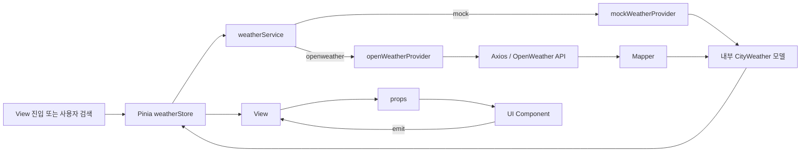

# Weather Walk

> 오늘, 어느 도시의 날씨가 좋을까요?

**Current release: v1.0.0**

Weather Walk는 국내 도시의 날씨를 단순한 숫자로 보여주는 데서 끝나지 않고,
**“오늘 걸어도 될까?”, “무엇을 챙겨야 할까?”, “어느 도시가 외출하기 더 좋을까?”**처럼 일상에서 바로 사용할 수 있는 정보로 바꾸어 보여주는 Vue 3 날씨 대시보드입니다.

OpenWeather의 실시간 날씨를 조회할 수 있으며, API Key가 없어도 준비된 Mock 데이터로 전체 기능을 실행할 수 있습니다. 지역별 날씨, 상세 예보, 생활 지수, 산책 추천, 외출 브리핑, 날씨별 음악 추천, 즐겨찾기와 도시 날씨 대결까지 한 프로젝트 안에서 확인할 수 있습니다.

---

## 목차

- [프로젝트 소개](#프로젝트-소개)
- [주요 기능](#주요-기능)
- [빠른 시작](#빠른-시작)
- [환경변수와 데이터 소스 설정](#환경변수와-데이터-소스-설정)
- [화면과 Route 구성](#화면과-route-구성)
- [기능 구현 상세](#기능-구현-상세)
- [생활 날씨 지수 계산](#생활-날씨-지수-계산)
- [도시 대결 규칙](#도시-대결-규칙)
- [데이터 구조와 처리 흐름](#데이터-구조와-처리-흐름)
- [Pinia Store](#pinia-store)
- [프로젝트 구조](#프로젝트-구조)
- [기술 스택](#기술-스택)
- [Vue 학습 요소](#vue-학습-요소)
- [코드 검사와 빌드](#코드-검사와-빌드)
- [v1.0 배포 안내](#v10-배포-안내)
- [문제 해결](#문제-해결)
- [현재 저장 정책과 제한 사항](#현재-저장-정책과-제한-사항)

---

## 프로젝트 소개

이 프로젝트는 Vue 수업에서 배운 기능을 하나씩 확장하여 만든 날씨 서비스입니다.

초기에는 배열을 순회해 도시 카드를 출력하고, 조건에 따라 “더움/선선함”을 나누는 과제로 시작했습니다. 이후 Composition API, 컴포넌트 통신, Pinia, Vue Router, Axios, Element Plus, 외부 API 연동을 적용하면서 현재의 멀티 페이지 대시보드 구조로 발전했습니다.

프로젝트가 중요하게 생각하는 기준은 다음과 같습니다.

1. **날씨를 행동으로 번역합니다.**
   기온과 강수확률만 나열하지 않고 산책 시간, 외출 준비물, 생활 지수와 음악을 추천합니다.

2. **Mock과 실 API가 같은 화면을 사용합니다.**
   Provider와 Mapper를 분리하여 데이터 출처가 바뀌어도 View와 컴포넌트를 수정하지 않습니다.

3. **외부 API 응답을 앱 내부에 그대로 퍼뜨리지 않습니다.**
   OpenWeather 응답은 고정된 내부 날씨 모델로 변환한 뒤 Store와 UI에 전달합니다.

4. **공유 상태와 화면 전용 상태를 구분합니다.**
   도시, 검색, 선택, 즐겨찾기와 설정은 Pinia가 관리하고, 도시 대결의 두 선택값과 운세 팝업 상태는 해당 View와 컴포넌트에만 둡니다.

5. **계산식은 UI에서 분리합니다.**
   생활 지수, 산책 시간, 준비물, 음악과 대결 결과는 Vue 컴포넌트가 아닌 순수 JavaScript 함수로 분리합니다.

---

## 주요 기능

### 날씨 조회

- 서울·수원·부산·울산·강릉·제주·광주·세종 8개 국내 도시 제공
- OpenWeather Current Weather API 기반 현재 날씨 조회
- OpenWeather 5 day / 3 hour Forecast 기반 시간대별·일별 예보
- Air Pollution API 기반 PM10 미세먼지 표시
- 도시명·행정명·영문 별칭 검색
- 국내 도시만 허용하는 Geocoding 검색
- 검색 결과에서 도시를 동적으로 추가
- 동일 ID 또는 동일 좌표 도시의 중복 추가 방지
- 즐겨찾기 도시 전용 화면

### 생활 정보

- 손세차 지수
- 야외활동 지수
- 얼죽아 지수
- 붕어빵 지수
- 모기 출현 지수
- 오늘의 외출 브리핑
- 날씨에 맞는 외출 준비물
- 산책하기 좋은 시간대
- 맑음·비·눈·천둥·우박에 맞는 산책 이미지
- 날씨와 도시 현지 시간대에 맞춘 Spotify 음악 추천

### 상세 예보

- 현재 기온과 체감 기온
- 습도, 풍속, 강수확률
- PM10 수치와 5단계 상태
- 위도와 경도
- 도시 현지 날짜 기준 오늘 03:00~24:00 예보
- 최대 5일간의 최저·최고 기온과 대표 날씨

### 사용자 설정과 UI

- 전역 섭씨/화씨 전환
- 전역 라이트/다크 모드 전환
- Element Plus Skeleton, Result, Empty, Dialog, DatePicker, Select 등 활용
- 로딩·오류·빈 결과 상태 분리
- 데스크톱·태블릿·모바일 반응형 레이아웃
- Glass UI를 기본으로 사용하고 도시 대결 화면에는 별도 레이싱 디자인 적용
- 모든 View Lazy Loading
- Catch-all 404 Route

### 미니게임

- 두 도시의 생활 지수 5종 비교
- 지수별 라운드 승자와 최종 승리 도시 표시
- 모기 지수는 낮은 도시가 승리하고 종합점수에서는 감점 요소로 계산
- 양쪽 도시의 상세 날씨 페이지로 이동
- 생년월일 기반 Mock “오늘의 레이스 운세” 팝업

---

## 빠른 시작

### 1. 실행 환경 확인

이 프로젝트는 다음 Node.js 버전을 지원합니다.

```text
Node.js 20.19 이상
또는 Node.js 22.12 이상
```

버전을 확인합니다.

```bash
node -v
npm -v
```

### 2. 저장소 내려받기

```bash
git clone https://github.com/dwk0714/skala-vue.git
cd skala-vue
```

이미 프로젝트 폴더가 있다면 해당 폴더에서 다음 단계부터 진행하면 됩니다.

### 3. 패키지 설치

```bash
npm install
```

### 4. API 없이 Mock 모드로 실행

환경변수 파일을 만들지 않으면 기본값인 Mock 모드로 동작합니다.

```bash
npm run dev
```

Vite 설정에 `--host`가 포함되어 있으므로 터미널에는 보통 다음과 같이 표시됩니다.

```text
Local:   http://localhost:5173/
Network: http://현재-IP:5173/
```

브라우저에서 Local 주소를 열면 됩니다. 5173 포트를 이미 다른 프로그램이 사용 중이면 Vite가 5174처럼 다음 포트를 자동으로 사용할 수 있으므로 터미널에 출력된 주소를 확인하세요.

### 5. 실시간 OpenWeather 모드로 실행

안전한 예시 파일을 복사해 `.env.local`을 만듭니다.

```bash
cp .env.example .env.local
```

복사한 `.env.local`을 열어 다음 값을 입력합니다.

```dotenv
VITE_WEATHER_SOURCE=openweather
VITE_OPENWEATHER_KEY=발급받은_API_KEY
```

개발 서버가 실행 중이었다면 환경변수를 다시 읽도록 종료 후 재실행합니다.

```bash
npm run dev
```

---

## 환경변수와 데이터 소스 설정

### Mock 모드

API Key 없이 안정적으로 모든 화면과 계산 결과를 확인하고 싶을 때 사용합니다.

```dotenv
VITE_WEATHER_SOURCE=mock
VITE_OPENWEATHER_KEY=
```

또는 `.env.local` 파일을 만들지 않아도 `mock`이 기본값으로 선택됩니다.

Mock 데이터는 단순히 같은 값을 복사한 데이터가 아닙니다. 도시별로 비, 바람, 습도와 기온을 다르게 배치하여 생활 지수의 `high`, `mid`, `low`, `none` 분기가 실제 화면에서 보이도록 구성했습니다.

### OpenWeather 모드

```dotenv
VITE_WEATHER_SOURCE=openweather
VITE_OPENWEATHER_KEY=발급받은_API_KEY
```

사용하는 OpenWeather API는 다음과 같습니다.

| 목적           | Endpoint                  |
| -------------- | ------------------------- |
| 도시 검색      | `/geo/1.0/direct`         |
| 현재 날씨      | `/data/2.5/weather`       |
| 5일·3시간 예보 | `/data/2.5/forecast`      |
| 대기오염       | `/data/2.5/air_pollution` |

날씨 요청에는 공통으로 다음 값이 전달됩니다.

```text
lat={위도}
lon={경도}
units=metric
lang=kr
appid={API_KEY}
```

도시명을 날씨 API에 직접 전달하지 않고, 카탈로그 또는 Geocoding으로 찾은 **위도와 경도**를 사용합니다.

### 왜 `.env.local`을 사용하나요?

- 개인 API Key를 Git에 올리지 않기 위해서입니다.
- `.env.local`은 `.gitignore`에 포함되어 있습니다.
- `VITE_` 접두사가 붙은 값은 브라우저 번들에서 읽을 수 있습니다.

> 주의: Vite의 `VITE_` 환경변수는 브라우저에서 완전히 숨겨지는 서버 비밀값이 아닙니다. 이 프로젝트에서는 수업용 OpenWeather Key만 사용하며, 결제·개인정보·관리자 권한과 관련된 비밀 Key는 백엔드 프록시에서 관리해야 합니다.

---

## 화면과 Route 구성

모든 View는 동적 `import()`를 사용해 필요한 페이지에 진입할 때 불러옵니다.

| URL                | Route name          | View                   | 설명                                       |
| ------------------ | ------------------- | ---------------------- | ------------------------------------------ |
| `/`                | `weather-landing`   | `WeatherLandingView`   | 도시 카드를 바로 불러오지 않는 서비스 랜딩 |
| `/weather`         | `weather-home`      | `WeatherHomeView`      | 도시 검색과 지역별 날씨 카드               |
| `/weather/:cityId` | `weather-detail`    | `WeatherDetailView`    | 도시 ID 기반 현재 관측·시간대별·일별 예보  |
| `/indices`         | `weather-indices`   | `WeatherIndicesView`   | 선택 도시의 생활 지수와 외출 추천          |
| `/favorites`       | `weather-favorites` | `WeatherFavoritesView` | 즐겨찾기 도시 목록                         |
| `/battle`          | `weather-battle`    | `WeatherBattleView`    | 두 도시의 생활 지수 대결과 운세 팝업       |
| `/about`           | `weather-about`     | `WeatherAboutView`     | 서비스 기능 소개                           |
| 그 외 경로         | `not-found`         | `NotFoundView`         | Catch-all 404 화면                         |

### 화면 이동 흐름

- 상단 브랜드 `Weather Walk` → 랜딩 페이지
- `지역 날씨` → 검색과 도시 카드
- 도시 카드 본문 클릭 → 해당 도시 선택 후 생활 지수
- 카드의 `상세보기` → 해당 도시 상세 예보
- 카드의 별 버튼 → 현재 페이지에 머물며 즐겨찾기 토글
- `도시 대결` → 도시 두 곳을 선택하는 미니게임

카드 안의 상세보기와 즐겨찾기에는 `@click.stop`을 사용합니다. 따라서 별 버튼만 눌렀는데 생활 지수 페이지로 이동하는 이벤트 버블링 문제를 막습니다.

---

## 기능 구현 상세

### 1. 지역 날씨와 점진적 로딩

실 API 모드에서 첫 화면이 24개 요청을 모두 기다리지 않도록 로딩을 두 단계로 나눴습니다.

#### 최초 지역 날씨 화면

8개 도시에 대해 현재 날씨 API만 요청합니다.

```text
8개 도시 × Current Weather 1회 = 8개 요청
```

요청은 `Promise.allSettled()`로 실행되며, 먼저 완료된 도시는 `onCity` 콜백을 통해 즉시 Store에 들어갑니다. 일부 도시 요청이 실패해도 성공한 도시 카드는 유지됩니다.

#### 상세 또는 생활 지수 진입

선택한 도시 한 곳에 대해서만 다음 두 요청을 병렬로 실행합니다.

```text
Forecast + Air Pollution = 2개 요청
```

같은 도시의 상세 요청이 동시에 발생하면 `detailRequests` Map에 진행 중 Promise를 보관하여 중복 호출을 막습니다.

#### 검색으로 새 도시 추가

새 도시는 현재 날씨, 예보, 대기오염을 모두 받아야 카드와 지수 화면을 바로 사용할 수 있으므로 세 요청을 병렬로 실행합니다.

### 2. 국내 도시 검색

검색 흐름은 다음 순서로 처리됩니다.

1. 검색어 앞뒤 공백을 제거하고 연속 공백을 정리합니다.
2. 한글과 영문 비교를 위해 소문자로 정규화합니다.
3. 국내 도시 카탈로그의 이름과 별칭을 먼저 검색합니다.
4. 카탈로그에 있으면 저장된 좌표를 사용해 API 호출을 줄입니다.
5. 카탈로그에 없으면 OpenWeather Geocoding API로 검색합니다.
6. 응답에서 `country === 'KR'`인 결과만 남깁니다.
7. 한글 이름은 `local_names.ko`를 우선합니다.
8. 좌표를 소수점 네 자리로 정규화해 안정적인 ID를 만듭니다.
9. 사용자가 결과를 선택한 뒤에만 날씨를 요청해 카드에 추가합니다.

초기 카탈로그는 다음 도시를 포함합니다.

| 도시 | 기준 행정구역  | 지원 별칭 예시                             |
| ---- | -------------- | ------------------------------------------ |
| 서울 | 서울특별시     | 서울, 서울시, 서울특별시, Seoul            |
| 수원 | 수원시         | 수원, 수원시, Suwon                        |
| 부산 | 부산광역시     | 부산, 부산시, 부산광역시, Busan            |
| 울산 | 울산광역시     | 울산, 울산시, 울산광역시, Ulsan            |
| 강릉 | 강릉시         | 강릉, 강릉시, Gangneung                    |
| 제주 | 제주시         | 제주, 제주시, 제주도, 제주특별자치도, Jeju |
| 광주 | 광주광역시     | 광주, 광주시, 광주광역시, Gwangju          |
| 세종 | 세종특별자치시 | 세종, 세종시, 세종특별자치시, Sejong       |

`광주`는 광주광역시, `제주`는 제주시를 기본으로 해석합니다. 동명 지역은 검색 결과에 `state`와 좌표를 함께 표시하여 구분합니다.

검색은 300ms 디바운스를 적용하며 새 검색이 시작되면 이전 `AbortController` 요청을 취소합니다. 최근 검색어는 중복을 제거하고 최신순 최대 5개까지만 유지합니다.

검색 결과가 없을 때는 불필요한 빈 패널이나 “일치하는 도시가 없습니다” 박스를 남기지 않고 결과 패널 자체를 닫습니다.

### 3. 도시 상세 날씨

상세 페이지에 직접 접근하거나 새로고침해도 Store의 `loadCities()`를 먼저 실행한 뒤 Route의 `cityId`와 일치하는 도시를 찾습니다.

현재 관측 영역에서 다음 정보를 제공합니다.

- 현재 기온
- 체감 기온
- 습도
- 풍속
- 강수확률
- PM10 수치와 상태
- 위도와 경도
- API 관측 업데이트 시각

#### 오늘 시간대별 예보

도시 현지 날짜를 기준으로 다음 8개 슬롯을 표시합니다.

```text
03:00 / 06:00 / 09:00 / 12:00 / 15:00 / 18:00 / 21:00 / 24:00
```

OpenWeather는 현재 시점 이후의 데이터만 반환하므로 이미 지난 시간은 “예보 종료” 상태로 표시될 수 있습니다. `24:00`은 다음 날 `00:00` 데이터를 오늘의 마지막 슬롯으로 표현한 값입니다.

#### 5일 일별 예보

3시간 간격 Forecast를 도시의 현지 날짜별로 묶고 다음 값을 계산합니다.

- 해당 날짜의 최저 기온
- 해당 날짜의 최고 기온
- 해당 날짜 중 가장 높은 강수확률
- 눈·뇌우·비처럼 외출에 영향이 큰 상태를 우선한 대표 날씨

UI에는 최대 5일까지만 표시하지만, 계산 함수 자체는 배열 길이를 하드코딩하지 않습니다.

### 4. PM10 미세먼지

OpenWeather Air Pollution 응답의 `components.pm10`을 사용합니다. 원본 소수값은 계산에 유지하고 화면에는 반올림한 정수와 상태를 함께 보여줍니다.

| PM10     | 표시      |
| -------- | --------- |
| 0~15     | 매우 좋음 |
| 16~30    | 좋음      |
| 31~80    | 보통      |
| 81~150   | 나쁨      |
| 151 이상 | 매우 나쁨 |

### 5. 섭씨와 화씨

API와 Mock의 원본 기온은 항상 섭씨로 유지합니다. 생활 지수 계산도 섭씨 기준입니다.

화씨는 화면에 표시할 때만 `useTemperature()` Composable에서 변환합니다.

```js
fahrenheit = Math.round((celsius * 9) / 5 + 32)
```

따라서 단위를 바꾸어도 원본 날씨, 산책 가능 여부, 생활 지수 점수와 도시 대결 승자는 달라지지 않습니다.

### 6. 오늘의 외출 브리핑

선택한 도시의 날씨를 짧은 행동 문장으로 변환합니다.

- 우박 → 안전한 실내 활동 권장
- 천둥·번개 → 야외 활동 연기 권장
- 눈 → 미끄러운 길과 이동 시간 주의
- 비 → 야외 일정을 짧게 조정
- 맑음 → 산책 가능한 시간 수 안내

문장 뒤에는 실제 추천 준비물 이름을 함께 표시합니다.

### 7. 외출 준비물

옷차림은 항상 하나 이상 포함되며 나머지 준비물은 조건에 맞을 때 추가됩니다.

| 준비 항목 | 조건                               |
| --------- | ---------------------------------- |
| 옷차림    | 기온에 따라 항상 포함              |
| 우산      | `pop >= 0.3`                       |
| 마스크    | `pm10 >= 50`                       |
| 물        | `temp >= 25` 또는 `humidity >= 70` |
| 바람막이  | `windSpeed > 8`                    |

### 8. 산책 추천 시간과 이미지

다음 조건을 모두 만족하는 시간만 추천합니다.

```js
hour.pop === 0 && hour.temp >= 15 && hour.temp <= 26 && 강수_상태_키워드가_없음
```

강수 상태에는 비, 소나기, 이슬비, 뇌우, 천둥, 번개, 눈, 진눈깨비와 우박이 포함됩니다.

추천 가능한 시간이 없다면 안전 안내 문구를 표시합니다. 산책 패널의 배경 이미지는 현재 날씨와 시간대별 예보를 분석해 다음 중 하나를 선택합니다.

- 맑은 날 산책
- 우산을 쓴 비 오는 날 산책
- 눈 오는 날
- 천둥·번개가 있는 날
- 우박이 있는 날

### 9. 오늘의 추천 음악

날씨 상태와 도시의 현지 시간대를 함께 사용해 Spotify 플레이리스트를 추천합니다.

날씨 그룹:

- 맑음
- 흐림·구름·안개
- 비
- 눈
- 천둥·우박

시간대 그룹:

- 아침: 05:00~11:59
- 낮: 12:00~17:59
- 저녁: 18:00~21:59
- 밤: 22:00~04:59

같은 도시와 같은 현지 날짜에는 첫 추천이 안정적으로 유지되도록 도시 ID와 날짜로 고정 순서를 만듭니다. 추천 목록은 로컬 JSON으로 관리하며 Spotify Embed로 재생합니다.

### 10. 즐겨찾기

도시 카드의 별 버튼으로 `isFavorite`을 전환합니다. `favoriteCities` Getter가 즐겨찾기 도시만 필터링하고 `/favorites`에서 렌더링합니다.

즐겨찾기 카드의 본문과 상세보기는 도시 상세 페이지로 이동합니다. 즐겨찾기가 하나도 없으면 지역 날씨 페이지로 돌아가는 안내 링크를 표시합니다.

> 현재 즐겨찾기는 Pinia 메모리 상태이며 새로고침하면 초기화됩니다.

### 11. 오늘의 레이스 운세

도시 대결 페이지의 “피트월 운세” 버튼으로 Element Plus Dialog를 엽니다.

- 입력값: 생년월일 하나
- 미래 날짜 선택 방지
- 로컬 `fortuneMock.json`에서 결과 선택
- 생년월일과 오늘 날짜를 조합한 간단한 시드 사용
- 같은 생년월일과 같은 날짜에는 같은 결과 표시
- 팝업을 닫으면 입력값과 결과 즉시 초기화
- Pinia, Local Storage, URL, 외부 API에 생년월일을 저장하거나 전송하지 않음

운세는 오락용 Mock 콘텐츠이며 실제 사주·점성술 API 결과가 아닙니다.

---

## 생활 날씨 지수 계산

모든 생활 지수는 `src/utils/indices/`의 독립적인 순수 함수입니다.

공통 계약은 다음과 같습니다.

```js
{
  id,
  label,
  icon,
  compute(weather) {
    return {
      score: 0,
      level: 'high' | 'mid' | 'low' | 'none',
      message: '',
    }
  },
}
```

`IndexGrid`는 `INDICES` 레지스트리를 `v-for`로 렌더링합니다. 새로운 지수는 계산 파일을 하나 추가하고 레지스트리에 등록하면 되므로 View와 카드 컴포넌트를 수정할 필요가 없습니다.

### 손세차 지수

기온, 현재 강수확률, PM10, 풍속, 습도를 합산하고 다음 비 예보로 추가 보정합니다.

| 요소 | 최대 배점 | 계산                                    |
| ---- | --------: | --------------------------------------- |
| 기온 |        30 | 10~25℃ 만점, 범위 밖은 1℃당 3점 감점    |
| 강수 |        25 | `25 × (1 - pop)`                        |
| PM10 |        20 | 30 이하 20점, 50 이하 14점, 80 이하 7점 |
| 풍속 |        15 | 3m/s 이하 15점, 6 이하 9점, 10 이하 4점 |
| 습도 |        10 | 60% 이하 10점, 75 이하 6점, 85 이하 3점 |

다음 비의 강수확률 기준은 60%입니다.

| 가장 빠른 비   | 보정           |
| -------------- | -------------- |
| 오늘           | 최종 0점       |
| 내일           | 최대 20점      |
| 2일 뒤         | 20점 감점      |
| 3일 뒤         | 10점 감점      |
| 이후 또는 없음 | 추가 감점 없음 |

### 야외활동 지수

100점에서 시작해 야외 활동을 방해하는 조건을 감점합니다.

- 적정 기온 15~26℃ 밖: 1℃당 4점, 최대 35점 감점
- 강수: `Math.round(pop × 40)` 감점
- PM10: 30 초과 10점, 50 초과 20점, 80 초과 30점 감점
- 풍속: 6m/s 초과 10점, 10m/s 초과 20점 감점
- 습도: 70% 초과 5점, 85% 초과 10점 감점

### 얼죽아 지수

기온 대신 체감 기온과 습도를 사용합니다.

```js
score = clamp(Math.round((feelsLike + 5) * 2.5 + Math.max(0, humidity - 50) * 0.3), 0, 100)
```

### 붕어빵 지수

기온이 낮을수록 점수가 올라가는 역방향 계절 지수입니다.

```js
temp >= 15 ? 0
temp <= 0  ? 100
그 외       Math.round(((15 - temp) / 15) * 100)
```

### 모기 출현 지수

- 15℃ 이하 또는 35℃ 이상에서는 온도 점수 0
- 25℃에서 온도 점수 최대
- 습도 40~80% 구간에서 가산
- 풍속에 따라 최대 25점 감점

다른 네 지수는 높을수록 좋은 점수이지만, **모기 출현 지수는 낮을수록 쾌적한 값**입니다. 이 차이는 도시 대결 계산에도 반영됩니다.

---

## 도시 대결 규칙

도시 대결은 별도의 전적 Store를 사용하지 않습니다. 두 도시 선택은 `WeatherBattleView`의 로컬 `ref`, 대결 결과는 `computed`로 관리합니다.

1. 서로 다른 도시 두 곳을 선택합니다.
2. 각 도시의 생활 지수 5종을 계산합니다.
3. 같은 지수끼리 점수를 비교합니다.
4. 손세차·야외활동·얼죽아·붕어빵은 높은 점수가 라운드에서 승리합니다.
5. 모기 출현은 낮은 점수가 라운드에서 승리합니다.
6. 동점인 지수는 라운드 무승부입니다.
7. 라운드 승리 수가 많은 도시가 최종 승리합니다.
8. 승리 수가 같으면 종합점수로 결정합니다.
9. 종합점수까지 같으면 최종 무승부입니다.

종합점수에서는 네 개의 일반 지수를 더하고 모기 출현 지수를 뺍니다.

```js
total = carWash + outdoorActivity + iceAmericano + bungeoppang - mosquito
```

화면에는 현재 대결의 최종 승자와 각 라운드 결과만 표시합니다. 전적이나 승패 기록은 Pinia, Local Storage 또는 서버에 저장하지 않습니다.

---

## 데이터 구조와 처리 흐름

### 전체 흐름



### 내부 날씨 모델

Mock과 OpenWeather 응답은 모두 다음 형태로 통일됩니다.

```js
{
  id: 'kr-seoul',
  name: '서울',
  apiName: 'Seoul',
  country: 'KR',
  state: '서울특별시',
  coords: {
    lat: 37.5665,
    lon: 126.978,
  },
  timezone: 32400,

  temp: 22,
  feelsLike: 24,
  status: '맑음',
  humidity: 55,
  windSpeed: 2.4,
  pop: 0.1,
  pm10: 25,

  forecast: [
    {
      dt: 1786460400,
      pop: 0.1,
      tempMin: 18,
      tempMax: 25,
      status: '맑음',
    },
  ],

  hourly: [
    {
      dt: 1786471200,
      temp: 18,
      feelsLike: 18,
      status: '맑음',
      pop: 0,
    },
  ],

  updatedAt: '2026-08-11T09:00:00+09:00',
  isFavorite: false,
}
```

필드 규칙:

- `coords`, `feelsLike`, `windSpeed`, `pop` 이름을 고정해 사용합니다.
- `pop`은 항상 0~1로 유지합니다.
- 백분율은 UI에서 `Math.round(pop * 100)`으로 변환합니다.
- 시간은 UNIX 초 `dt`와 도시의 `timezone`으로 계산합니다.
- 산책 가능 여부 같은 파생 Boolean을 모델에 저장하지 않고 원본 날씨에서 계산합니다.

### OpenWeather Mapper

| 내부 필드   | OpenWeather 응답                               |
| ----------- | ---------------------------------------------- |
| `temp`      | `current.main.temp`                            |
| `feelsLike` | `current.main.feels_like`                      |
| `status`    | `current.weather[0].main`을 한글 상태로 정규화 |
| `humidity`  | `current.main.humidity`                        |
| `windSpeed` | `current.wind.speed`                           |
| `coords`    | `current.coord`                                |
| `timezone`  | `current.timezone`                             |
| `updatedAt` | `current.dt`                                   |
| `pm10`      | `airPollution.list[0].components.pm10`         |
| `hourly`    | `forecast.list` 변환                           |
| `forecast`  | 현지 날짜별 Forecast 그룹                      |

Mapper는 결측 필드에 안전한 기본값을 제공하고 강수확률을 0~1로 제한합니다.

### Provider 공통 인터페이스

| 메서드                                | 역할                              |
| ------------------------------------- | --------------------------------- |
| `listInitialCities(options)`          | 초기 8개 도시 로딩                |
| `searchCities(query, options)`        | 로컬 카탈로그 또는 Geocoding 검색 |
| `fetchCitySummary(location, options)` | 현재 날씨만 조회                  |
| `fetchCityDetails(location, options)` | 예보와 PM10 보충                  |
| `fetchCityWeather(location, options)` | 현재·예보·PM10 전체 조회          |

Mock Provider도 `async` 인터페이스를 사용하기 때문에 Store에서 데이터 출처별 분기 없이 동일하게 `await`할 수 있습니다. Mock 반환값은 `structuredClone()`으로 복사해 원본 데이터가 즐겨찾기 변경 등으로 오염되지 않게 합니다.

---

## Pinia Store

### weatherStore

날씨 도메인의 공유 상태를 관리하는 Setup Store입니다.

#### State

| 상태             | 설명                                |
| ---------------- | ----------------------------------- |
| `cities`         | 현재 화면에서 사용할 도시 날씨 배열 |
| `selectedCityId` | 선택된 도시 ID                      |
| `searchQuery`    | 검색 입력값                         |
| `recentSearches` | 최근 검색어 최대 5개                |
| `searchResults`  | 도시 검색 후보                      |
| `searchStatus`   | 검색 상태                           |
| `cityLoadStatus` | 도시별 상세 로딩 상태               |
| `loadStatus`     | 초기 목록 로딩 상태                 |
| `error`          | 사용자에게 표시할 오류 메시지       |

#### Getters

| Getter           | 설명                                    |
| ---------------- | --------------------------------------- |
| `selectedCity`   | 선택 ID에 해당하는 도시, 없으면 첫 도시 |
| `filteredCities` | 검색어에 맞는 도시 목록                 |
| `favoriteCities` | `isFavorite`인 도시 목록                |

#### Actions

| Action                              | 설명                                       |
| ----------------------------------- | ------------------------------------------ |
| `loadCities()`                      | 초기 도시를 중복 없이 로딩                 |
| `ensureCityDetails(cityId)`         | 선택 도시의 Forecast와 PM10을 한 번만 보충 |
| `searchCities(query)`               | 300ms 디바운스 검색                        |
| `clearSearch()`                     | 검색 타이머·요청·결과 정리                 |
| `addCityFromSearchResult(location)` | 검색 결과 도시 날씨 조회 후 추가           |
| `removeCity(cityId)`                | 도시 제거                                  |
| `selectCity(cityId)`                | 존재하는 도시만 선택                       |
| `toggleFavorite(cityId)`            | 즐겨찾기 전환                              |
| `addRecentSearch(query)`            | 최근 검색어 최신순 추가                    |
| `removeRecentSearch(query)`         | 최근 검색어 삭제                           |
| `refreshCity(cityId)`               | 즐겨찾기 값을 유지하며 날씨 새로고침       |

### configStore

화면 전체에서 공유하는 표시 설정을 관리합니다.

| 구분   | 이름            | 설명                        |
| ------ | --------------- | --------------------------- |
| State  | `unit`          | `celsius` 또는 `fahrenheit` |
| State  | `theme`         | `light` 또는 `dark`         |
| Getter | `unitSymbol`    | `°C` 또는 `°F`              |
| Action | `toggleUnit()`  | 섭씨와 화씨 전환            |
| Action | `toggleTheme()` | 라이트와 다크 모드 전환     |

### counter Store

`src/stores/counter.js`는 Pinia 사용법을 학습하기 위한 별도 코드 챌린지 예제입니다. 실제 날씨 기능과 연결되지 않으며 `StoreExample.vue`에서 `storeToRefs()`, Getter와 Action 사용법을 보여줍니다.

### Store와 영속 저장의 차이

Pinia Store는 현재 브라우저 탭의 JavaScript 메모리에 존재합니다. 라우트로 페이지를 이동하는 동안은 유지되지만 새로고침하면 초기화됩니다.

현재 프로젝트는 Local Storage 영속화를 사용하지 않습니다. 따라서 다음 값은 새로고침 후 초기화됩니다.

- 선택 도시
- 검색으로 추가한 도시
- 최근 검색어
- 즐겨찾기
- 섭씨/화씨
- 라이트/다크 모드

도시 대결 선택, 대결 결과와 운세 생년월일도 저장하지 않습니다.

---

## 프로젝트 구조

```text
src/
├── App.vue
├── main.js
├── router/
│   └── index.js
│
├── views/
│   ├── NotFoundView.vue
│   └── weather/
│       ├── WeatherLandingView.vue
│       ├── WeatherHomeView.vue
│       ├── WeatherFavoritesView.vue
│       ├── WeatherIndicesView.vue
│       ├── WeatherBattleView.vue
│       ├── WeatherDetailView.vue
│       └── WeatherAboutView.vue
│
├── components/
│   ├── practices/
│   │   ├── basic/
│   │   └── component/
│   └── weather/
│       ├── game/
│       │   └── FortuneModal.vue
│       ├── indices/
│       │   ├── IndexGrid.vue
│       │   └── IndexCard.vue
│       ├── recommendations/
│       │   ├── PreparationPanel.vue
│       │   ├── WalkTimePanel.vue
│       │   └── WeatherMusicPanel.vue
│       ├── search/
│       │   ├── SearchBar.vue
│       │   └── CitySearchResults.vue
│       └── shared/
│           ├── BaseDashboardCard.vue
│           ├── UnitToggler.vue
│           └── WeatherCard.vue
│
├── stores/
│   ├── weatherStore.js
│   ├── configStore.js
│   └── counter.js
│
├── composables/
│   └── useTemperature.js
│
├── services/
│   ├── weatherService.js
│   ├── providers/
│   │   ├── mockWeatherProvider.js
│   │   └── openWeatherProvider.js
│   └── mappers/
│       ├── locationMapper.js
│       └── openWeatherMapper.js
│
├── data/
│   ├── koreanCityCatalog.js
│   ├── weatherMock.js
│   ├── fortuneMock.json
│   └── weatherMusic.json
│
├── utils/
│   ├── citySearch.js
│   ├── formatRelativeTime.js
│   ├── weatherBattle.js
│   ├── weatherModel.js
│   ├── indices/
│   │   ├── index.js
│   │   ├── carWash.js
│   │   ├── outdoorActivity.js
│   │   ├── iceAmericano.js
│   │   ├── bungeoppang.js
│   │   └── mosquito.js
│   └── recommendations/
│       ├── preparation.js
│       ├── walkTimes.js
│       └── music.js
│
└── assets/
    ├── styles/
    │   ├── reset.css
    │   ├── tokens.css
    │   ├── global.css
    │   └── element-plus.css
    └── images/
        ├── battle/
        └── walk/
```

### 폴더별 역할

| 폴더                      | 역할                                       |
| ------------------------- | ------------------------------------------ |
| `views`                   | Route와 연결되는 페이지 단위 데이터 흐름   |
| `components`              | props와 emit 중심의 재사용 UI              |
| `stores`                  | 여러 View가 공유하는 반응형 상태와 Action  |
| `composables`             | Vue 반응성을 재사용하는 기능               |
| `services`                | 데이터 공급자 선택과 외부 API 호출         |
| `providers`               | Mock 또는 OpenWeather라는 실제 데이터 출처 |
| `mappers`                 | 외부 응답을 내부 모델로 변환               |
| `data`                    | 도시 카탈로그, Mock 날씨, 운세와 음악 목록 |
| `utils`                   | Vue와 무관한 순수 계산                     |
| `assets/styles`           | 전역 디자인 토큰, 리셋, Element Plus 보정  |
| Vue 파일의 `style scoped` | 해당 컴포넌트에만 필요한 레이아웃과 표현   |

`components/practices`는 수업 실습 기록을 보존하는 폴더이며 현재 날씨 라우트의 UI 구성에는 사용하지 않습니다.

---

## 기술 스택

| 구분          | 기술                   | 사용 목적                                       |
| ------------- | ---------------------- | ----------------------------------------------- |
| UI 프레임워크 | Vue 3                  | Composition API와 `<script setup>`              |
| 빌드 도구     | Vite 8                 | 개발 서버, 환경변수, 프로덕션 빌드              |
| 상태 관리     | Pinia 3                | 도시·검색·즐겨찾기·표시 설정 공유               |
| 라우팅        | Vue Router 5           | Lazy Route, 동적 도시 ID, 404                   |
| HTTP          | Axios                  | OpenWeather API의 `async/await` 요청            |
| UI 라이브러리 | Element Plus           | Skeleton, Dialog, DatePicker, Select, Result 등 |
| 아이콘        | Element Plus Icons Vue | 검색·깃발 등 인터페이스 아이콘                  |
| 스타일        | CSS                    | 디자인 토큰, Glass UI, 다크 모드, 반응형 화면   |
| 정적 검사     | ESLint, Oxlint         | 문법·Vue 규칙·코드 품질 검사                    |
| 포맷          | Prettier               | 소스 코드 형식 통일                             |

Element Plus 컴포넌트는 `unplugin-auto-import`와 `unplugin-vue-components` 설정으로 자동 import됩니다. 따라서 Vue 템플릿에서 `<ElSkeleton>`, `<ElDialog>` 등을 직접 사용할 수 있습니다.

---

## Vue 학습 요소

### Composition API

- `ref`: 검색어, 도시 대결 선택, 팝업 열림 여부
- `computed`: 선택 도시, 검색 필터, 즐겨찾기, 지수와 대결 결과
- `watch`: 검색어 변경, Route 도시 변경, 운세 입력 변경
- `watchEffect`: 전역 테마를 HTML dataset과 Element Plus 다크 클래스에 반영
- `onMounted`: 초기 도시 로딩과 타이머 시작
- `onBeforeUnmount`: 검색 취소와 상대 시간 타이머 정리

### Template 문법

- `v-for`: 도시 카드, 생활 지수, 시간대별 예보, 일별 예보
- `v-if / v-else`: 로딩·오류·빈 결과, 더움·선선함, 승리·무승부
- `v-model`: 도시 선택 Select, 생년월일 DatePicker
- `:class`: 선택 도시, 지수 등급, 승자 강조
- `@click.stop`: 카드 내부 버튼의 이벤트 버블링 방지
- `@submit.prevent`: 검색 폼 새로고침 차단
- `Transition / TransitionGroup`: 페이지와 도시 카드 변화

### props와 emit

`WeatherCard`는 Store를 직접 import하지 않습니다. 도시 객체와 선택 상태를 props로 받고 다음 이벤트를 부모 View로 보냅니다.

- `select-card`
- `click-detail`
- `toggle-favorite`

`SearchBar` 역시 검색 API를 직접 호출하지 않고 입력과 사용자 이벤트만 emit합니다. View가 이벤트를 받아 Store Action을 실행합니다.

### Pinia와 `storeToRefs()`

Store의 State와 Getter를 구조 분해할 때 반응성을 잃지 않도록 `storeToRefs()`를 사용합니다. Action은 Store 인스턴스에서 직접 호출합니다.

```js
const store = useWeatherStore()
const { cities, selectedCity, loadStatus } = storeToRefs(store)

store.loadCities()
```

### Router

- `RouterLink`: 상단 내비게이션과 단순 페이지 이동
- `router.push()`: 도시를 선택한 뒤 생활 지수 또는 상세 페이지로 이동
- `route.params.cityId`: 동적 도시 상세 조회
- Catch-all Route: 정의되지 않은 주소를 404 View로 연결

### async/await와 Promise

Axios 요청은 `async/await`으로 읽기 쉽게 작성했습니다. 여러 독립 요청을 동시에 시작해야 할 때는 `Promise.all()` 또는 `Promise.allSettled()`을 `await`합니다.

두 문법은 서로 대체 관계가 아닙니다.

- `async/await`: Promise 결과를 순서대로 읽기 쉽게 다루는 문법
- `Promise.all`: 여러 Promise를 동시에 기다리는 병렬 처리 도구
- `Promise.allSettled`: 일부 요청 실패와 성공을 함께 수집하는 도구

---

## 코드 검사와 빌드

### Lint

```bash
npm run lint
```

Oxlint와 ESLint가 순서대로 실행됩니다. 현재 스크립트에는 자동 수정 옵션이 포함되어 있으므로 실행 전 작업 중인 변경사항을 확인하는 것이 좋습니다.

### Format

```bash
npm run format
```

### 프로덕션 빌드

```bash
npm run build
```

결과물은 `dist/`에 생성됩니다.

### 빌드 결과 미리보기

```bash
npm run preview
```

최종 확인 권장 순서:

```bash
npm run lint
npm run build
```

---

## v1.0 배포 안내

### Mock 관련 파일을 배포에 포함하는 이유

다음 파일은 개발 중에만 사용하는 임시 파일처럼 보이지만, 현재 v1.0 구조에서는 **배포 빌드에 포함해야 하는 런타임 자산**입니다.

| 파일                                            | 배포 저장소에 필요한 이유                                                         |
| ----------------------------------------------- | --------------------------------------------------------------------------------- |
| `src/services/providers/mockWeatherProvider.js` | `weatherService.js`가 정적으로 import하며 API 설정이 없을 때 기본 Provider로 사용 |
| `src/data/weatherMock.js`                       | Mock 모드에서 화면·지수·추천·대결에 사용하는 실제 런타임 데이터                   |
| `src/data/fortuneMock.json`                     | “오늘의 레이스 운세”가 화면에서 직접 읽는 런타임 데이터                           |

이 파일들을 `.gitignore`에 추가하면 로컬에는 파일이 남아 있어 당장 문제가 없어 보일 수 있지만, 새로 clone한 CI·배포 서버에는 파일이 내려오지 않습니다. 그러면 정적 import 해석 단계에서 빌드가 실패하거나 운세 기능이 동작하지 않습니다.

따라서 v1.0에서는 Mock 관련 파일을 의도적으로 Git에 포함합니다. 향후 Mock 모드를 완전히 제거하려면 파일만 ignore하는 것이 아니라 다음 작업을 함께 해야 합니다.

1. `weatherService.js`에서 Mock Provider import와 분기를 제거합니다.
2. 기본 데이터 소스를 `openweather`로 변경합니다.
3. API Key가 없는 배포 환경에서 보여줄 설정 오류 화면을 확인합니다.

`test/`는 앱에서 import하지 않고 Vite 빌드에도 포함되지 않는 로컬 검증 코드입니다. 배포 실행에 필요하지 않으므로 Git 추적 대상에서 제외하고 `.gitignore`로 관리합니다.

### 배포 환경 설정

정적 호스팅 서비스에는 다음 값을 사용합니다.

| 설정             | 값                          |
| ---------------- | --------------------------- |
| Install command  | `npm install` 또는 `npm ci` |
| Build command    | `npm run build`             |
| Output directory | `dist`                      |
| Node.js          | 20.19 이상 또는 22.12 이상  |

실시간 날씨로 배포할 때는 호스팅 서비스의 Environment Variables에 다음 값을 등록합니다.

```dotenv
VITE_WEATHER_SOURCE=openweather
VITE_OPENWEATHER_KEY=배포_서비스에_등록한_API_KEY
```

`.env.local`은 로컬 개발용이므로 Git에 올리지 않습니다. `.env.example`에는 변수 이름과 안전한 기본값만 기록합니다.

### 배포 전 체크리스트

- [ ] `npm ci` 또는 `npm install` 성공
- [ ] `npm run lint` 성공
- [ ] `npm run build` 성공
- [ ] 배포 환경의 OpenWeather 변수 등록
- [ ] `.env.local`과 실제 API Key가 Git에 포함되지 않았는지 확인
- [ ] `/`, `/weather`, `/weather/:cityId`, `/indices`, `/favorites`, `/battle`, `/about` 직접 접근 확인
- [ ] 라이트·다크 모드와 섭씨·화씨 전환 확인
- [ ] 모바일 레이아웃과 도시 검색 확인

---

## 문제 해결

### `npm install`에서 ERESOLVE가 발생합니다

의존성 버전이 서로 요구하는 Peer Dependency와 맞지 않을 때 발생합니다. 먼저 `package.json`과 `package-lock.json`을 함께 유지한 상태에서 다음 명령을 사용하세요.

```bash
npm install
```

무조건 `--force`나 `--legacy-peer-deps`를 사용하면 실제로 맞지 않는 조합을 설치할 수 있습니다. 특히 `oxlint`와 `eslint-plugin-oxlint`는 호환되는 버전 범위를 맞춰야 합니다.

### OpenWeather 요청이 401입니다

다음을 확인하세요.

1. `.env.local`의 변수명이 `VITE_OPENWEATHER_KEY`인지 확인합니다.
2. Key 앞뒤에 따옴표나 불필요한 공백이 없는지 확인합니다.
3. OpenWeather 계정에서 Key가 Active 상태인지 확인합니다.
4. 새 Key는 활성화까지 시간이 걸릴 수 있습니다.
5. 개발 서버를 종료하고 다시 시작합니다.
6. Postman에서 같은 Key로 Current Weather 요청이 200인지 확인합니다.

예시:

```text
https://api.openweathermap.org/data/2.5/weather
?lat=37.5665
&lon=126.9780
&units=metric
&lang=kr
&appid=YOUR_API_KEY
```

API Key가 포함된 전체 URL이나 Axios 오류 객체를 공개 저장소, 화면 캡처 또는 콘솔 로그에 올리지 마세요.

### 요청이 429입니다

OpenWeather 요청 한도를 초과한 상태입니다. 잠시 기다린 뒤 다시 시도하거나 Mock 모드로 전환하세요.

```dotenv
VITE_WEATHER_SOURCE=mock
```

### `npm run dev`를 실행했는데 브라우저가 자동으로 열리지 않습니다

Vite는 기본적으로 터미널에 주소만 표시합니다. 출력된 `Local` 주소를 브라우저에 직접 입력하세요.

### 다른 기기에서 접속하고 싶습니다

`package.json`의 개발 명령은 이미 `vite --host`로 설정되어 있습니다. 같은 네트워크의 기기에서 터미널에 표시된 `Network` 주소로 접속할 수 있습니다.

방화벽, 회사 네트워크 또는 공유기 설정에 따라 접근이 차단될 수 있습니다.

### 검색 결과가 없습니다

Mock 모드는 로컬 국내 도시 카탈로그 안에서만 검색합니다. 카탈로그에 없는 도시를 동적으로 검색하려면 OpenWeather 모드를 사용해야 합니다.

OpenWeather 모드에서도 결과는 국내 `KR` 지역으로 제한됩니다.

### 새로고침했더니 즐겨찾기와 설정이 사라졌습니다

현재 의도된 동작입니다. Pinia 상태를 Local Storage에 저장하지 않기 때문에 새로고침 시 초기화됩니다.

---

## 현재 저장 정책과 제한 사항

- 날씨 데이터와 설정은 브라우저 메모리에만 유지됩니다.
- 즐겨찾기와 최근 검색은 새로고침하면 초기화됩니다.
- 도시 대결 결과와 전적은 저장하지 않습니다.
- 운세 생년월일은 팝업을 닫는 즉시 초기화되며 외부로 보내지 않습니다.
- 운세는 로컬 Mock JSON 기반의 오락용 콘텐츠입니다.
- 음악 추천 목록은 로컬 JSON이며 실제 재생은 Spotify Embed와 네트워크 상태에 영향을 받습니다.
- OpenWeather 무료 5 day / 3 hour Forecast 범위 안에서만 일별 예보를 제공합니다.
- 자외선, 체감 강수량, 실시간 레이더와 기상 특보는 아직 제공하지 않습니다.
- `VITE_OPENWEATHER_KEY`는 브라우저에서 사용하는 수업용 Key입니다. 비밀성이 필요한 API는 별도 백엔드가 필요합니다.

---

## 참고 링크

- [Vue 공식 문서](https://vuejs.org/)
- [Pinia 공식 문서](https://pinia.vuejs.org/)
- [Vue Router 공식 문서](https://router.vuejs.org/)
- [Vite 공식 문서](https://vite.dev/)
- [Element Plus 공식 문서](https://element-plus.org/)
- [Axios 공식 문서](https://axios-http.com/)
- [OpenWeather Current Weather API](https://openweathermap.org/current)
- [OpenWeather 5 Day / 3 Hour Forecast](https://openweathermap.org/forecast5)
- [OpenWeather Geocoding API](https://openweathermap.org/api/geocoding-api)
- [OpenWeather Air Pollution API](https://openweathermap.org/api/air-pollution)

---

Weather Walk는 학습 과정에서 기능과 구조를 단계적으로 확장한 프로젝트입니다.
기능을 추가할 때는 **외부 응답은 Mapper로 정리하고, 공유 상태는 Store에 두며, 계산은 순수 함수로 분리하고, UI는 props/emit 중심으로 유지하는 것**을 기본 원칙으로 합니다.
